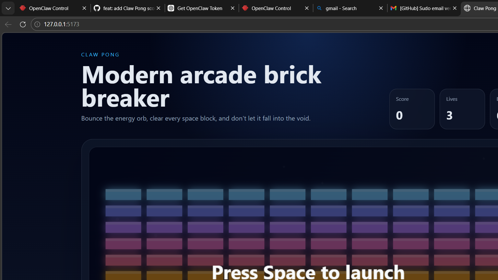

# Claw Pong

Modern arcade brick-breaker built with Vite and vanilla JavaScript.

## Concept

Claw Pong mixes paddle control with a glowing energy ball in space:
- guide the disk/paddle left and right
- bounce the orb upward
- destroy every floating block
- earn score for each collision
- win when the last block disappears

## Controls

- `Left / Right Arrow` or `A / D` — move paddle
- `Space` — launch ball / restart after win or loss
- `Mouse` — optional paddle movement

## Run locally

```bash
npm install
npm run dev
```

## Build

```bash
npm run build
```

## License

This project is licensed under the MIT License. See [`LICENSE`](./LICENSE).

## Screenshots

### Gameplay preview



## Next steps

This first pass sets up:
- project structure
- playable game loop
- scoring, lives, and win/lose states
- modern neon visual style
- mouse-based paddle control

Future improvements can add sound, power-ups, levels, particle bursts, and mobile touch controls.

## Polish roadmap

Planned quality upgrades for the next PR:
- particle hit effects
- progressive difficulty tuning
- touch controls for mobile
- better sound and feedback
